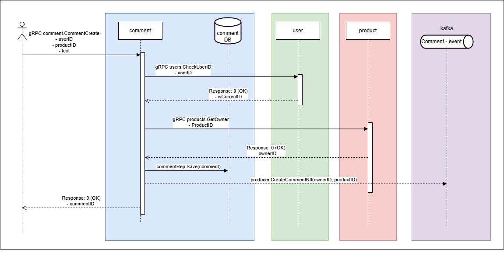

# Демонстрационный проект

Состав проекта:
- comments - основной сервис проекта // TODO написание тестов
- external - вспомогательный сервис, имитирующий работу внешних сервисов (проверяет что userID и productID < 100)
- postgres - база данных
- kafka - для передачи асинхронных сообщений
- jaeger - для хранения трейсов и спанов
- prometheus - для хранения метрик //TODO сбор метрик

## comments

Сервис, отвечающий за создание, хранение и обработку пользовательских отзывов о товарах. Каждый пользователь может оставлять произвольное количество отзывов на любом из товаров.

Все оставленные отзывы должны быть сразу же доступны всем пользователям.

## Спецификация

Основной доступ к сервису по gRPC, но добавлен HTTP gateway.

### Добавление комментария

При вызове данного метода в БД сохраняется комментарий, ассоциированный с пользователем и товаром. Любой пользователь может оставить произвольное количество комментариев на любом количестве товаров. При сохранении комментария проводится проверка существования пользователя и товара. В случае успешного сохранения комментария, владельцу товара отправляется асинхронное уведомление об его создании.



**Параметры запроса:**

| Параметр   | Тип данных | Валидация           | Описание                                         |
|------------|------------|---------------------|--------------------------------------------------|
| user_id    | int64      | > 0                 | Идентификатор пользователя, автора комментария   |
| product_id | int64      | > 0                 | Идентификатор товара, к которому относится отзыв |
| comment    | string     | len > 0, len <= 255 | Текст комментария                                |

Request
```
{
    user_id int64,
    product_id int64,
    comment string
}
```

**Параметры ответа:**

| Параметр | Тип данных | Описание             |
|----------|------------|----------------------|
| id       | int64      | Идентификатор отзыва |

Response
```
{
    id int64
}
```

### Список комментариев на товаре

При вызове данный метод возвращает список отзывов, относящихся к товару, отсортированный в обратном хронологическом порядке.
Не требуется проверять существования товара.

**Параметры запроса:**

| Параметр | Тип данных | Валидация  | Описание                                                  |
|----------|------------|------------|-----------------------------------------------------------|
| id       | int64      | > 0        | Идентификатор товара, отзывы к которому мы хотим получить |

Request
```
{
    id int64
}
```

**Параметры ответа:**

| Параметр   | Тип данных | Описание                                       |
|------------|------------|------------------------------------------------|
| id         | int64      | Идентификатор комментария                      |
| user_id    | int64      | Идентификатор пользователя, автора комментария |
| comment    | string     | Текст комментария                              |
| created_at | time       | Момент создания комментария                    |

Response
```
{
    comments [
        {
            id int64,
            user_id int64,
            comment string,
            created_at time
        },
        {...}
    ]
}
```
